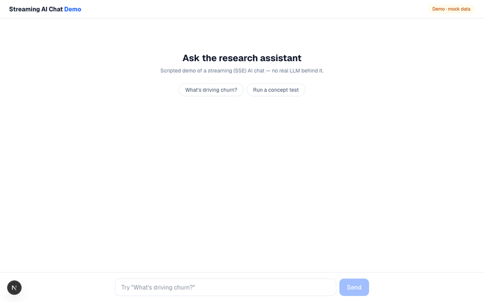

# Streaming AI Chat Demo

**Live demo:** https://streaming-ai-chat-five.vercel.app

A scripted, self-contained demo of the streaming-chat UX patterns I ship in
production AI products: token-by-token SSE rendering, a delta/metadata event
contract, typed answer cards, a detail canvas, and progress UX for long jobs.
**No real LLM behind it — deterministic mock data** (that's the point: the demo
is about the frontend contract and UX, not the model).

## Why the event contract matters

Streaming answers as one JSON blob parsed at completion is fragile: partial
JSON can't be parsed, and structured payloads (cards, citations, follow-ups)
silently vanish when the stream is interrupted. This demo uses the contract
I use in production:

    event: delta      data: {"text":"..."}        ← body tokens, render immediately
    event: metadata   data: {"cards":[...], ...}  ← structured payload, separate event
    event: progress   data: {"stage":"...","ratio":0.6}
    event: done / error

- `lib/sse-parser.ts` — incremental parser, tested across chunk boundaries
- `lib/chat-reducer.ts` — pure state transitions (delta/metadata/stop/error), tested
- `app/api/chat/route.ts` — Node runtime + `no-transform` headers so proxies
  don't buffer the stream

## Run locally

    npm install && npm run dev

## Stack

Next.js 16 (App Router) · TypeScript · Tailwind CSS v4 · Vitest
